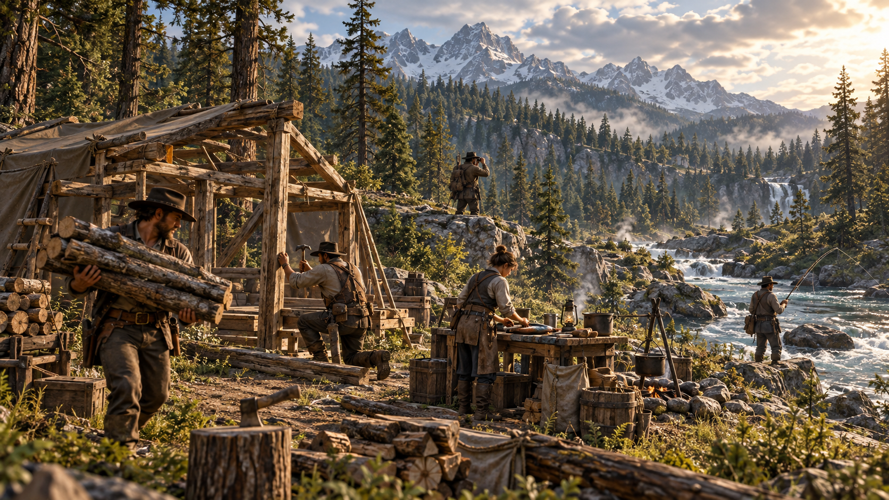

# Core Gameplay

> **CONCEPT ART - AI ASSISTED. Not an in-game screenshot.**

The game is not primarily about surviving hunger and thirst bars.

Personal survival exists, but should remain lightweight.

The deeper survival systems concern:

- the ecosystem
- the territory
- the community
- resources
- infrastructure
- cooperation

Players should be able to:

- explore
- build
- hunt
- fish
- farm
- gather
- craft
- trade
- cooperate
- travel
- discover
- improve their settlement

The first playable prototype should focus only on:

1. realistic player movement
2. a beautiful forest environment
3. terrain
4. a river
5. basic wildlife
6. tree cutting
7. resource gathering
8. simple construction
9. environmental consequences
10. cooperation between a small number of players

Systems beyond this first playable scope are intentionally outside the initial prototype.
