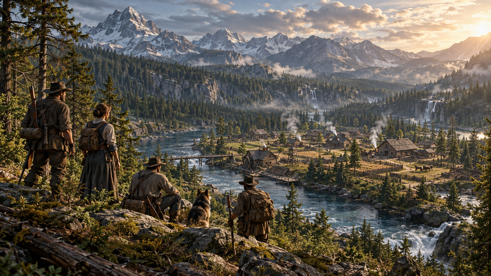
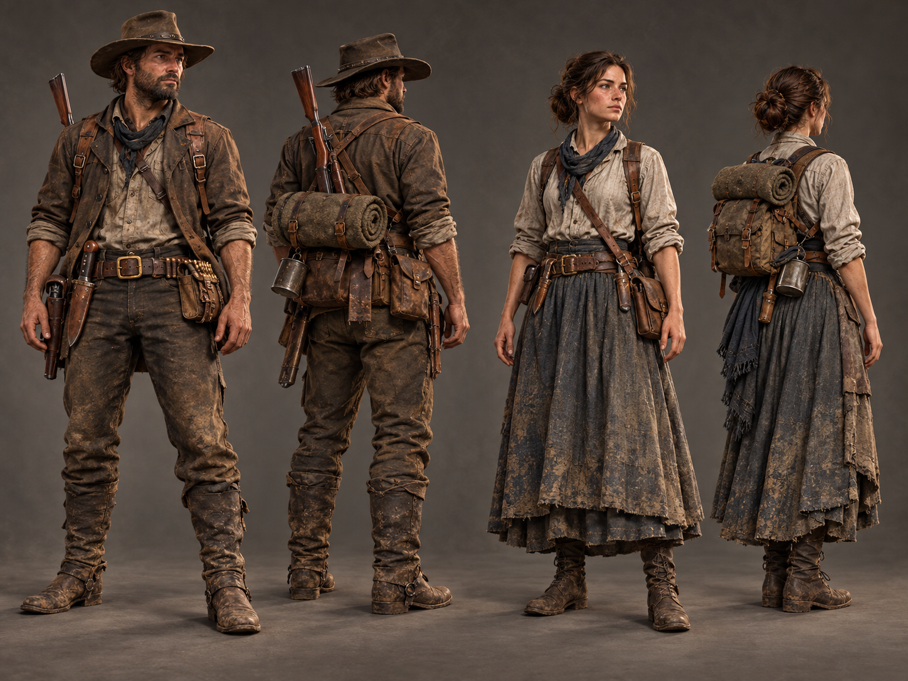
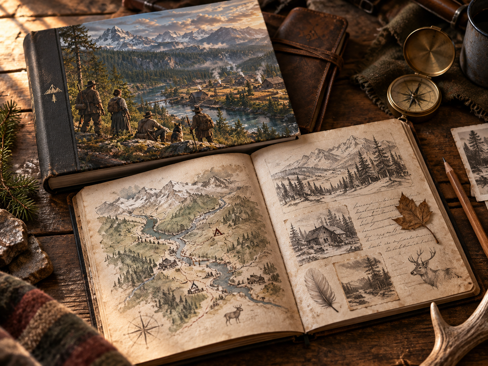

# This World Does Not Have a Name Yet

Early foundation of a realistic, persistent cooperative world.

  
  
  
  
  
  
  
  
  

> 🌐 **Official Live Portal:** [https://unnamed-world.vercel.app](https://unnamed-world.vercel.app)  
> 📖 **Book Zero (Chapter 1 Interactive Tome):** [https://unnamed-world.vercel.app/livro](https://unnamed-world.vercel.app/livro)

> **CONCEPT ART - AI ASSISTED**  
> This image communicates the intended world, scale and atmosphere. It is not an in-game screenshot.

Before this project has a final name, it has a reason to exist.

The world does not exist to serve the player.

The world remembers what people do.

There is no destiny. There are choices.

The main survival challenge is not keeping a hunger bar full. It is learning how to keep a world, an ecosystem and a community alive.

## The Beginning

A group of people reaches an unknown territory looking for a new beginning.

Early in the journey, they must cross a river. An experienced man enters the water. He knows how to swim. He has a family waiting for him.

The river takes him anyway.

The river is not evil. It simply continues flowing.

That idea defines the world we want to build: nature is beautiful, dangerous and indifferent, while human choices create consequences that can remain for years.

Read the current story foundation in [STORY.md](STORY.md) and the first-book direction in [book/BOOK_ZERO.md](book/BOOK_ZERO.md).

## A World That Remembers

Actions should have consequences. Forests can recover or decline. Rivers, soil, wildlife and settlements can change. Communities can grow, fail, disappear and later be rediscovered.

Updates should add history instead of constantly erasing it.

Read more in [WORLD.md](WORLD.md) and [VISION.md](VISION.md).

## People Matter Because of Their Choices

There are no chosen heroes and no prophecy at the center of this project. People become important because of what they build, discover, protect, change or fail to protect.

The visual direction is realistic: realistic humans, clothing, fauna, terrain, vegetation, water, weather and lighting.

## Built Around Cooperation

The first playable prototype is intentionally small. It should prove the core before the project grows:

- realistic player movement;
- a small realistic forest;
- terrain and a river;
- basic wildlife;
- tree cutting and gathering;
- simple construction;
- an initial environmental consequence;
- cooperation between 2 and 5 players.

Read the current gameplay scope in [GAMEPLAY.md](GAMEPLAY.md) and the staged plan in [ROADMAP.md](ROADMAP.md).

## Consequences Create Stories

Realism should create meaningful situations. It should not turn the game into repetitive work.

The goal is to let players make mistakes, see the world respond, learn, cooperate and recover when recovery is still possible.

## Book Zero

Before the larger game is built, we are developing **Book Zero**: the story that introduces the world before players begin creating its later history.

The book is still in early development. Its final period, location, cast and title have not been decided.

## First Community Milestone: Name This World

The project intentionally does not have a final public name yet.

One of the first things the community will help decide is the name of the game and its wider universe. Suggestions will be filtered for originality, international usability, brand strength and practical availability before a final community decision.

See [NAME_THE_WORLD.md](NAME_THE_WORLD.md) for the initial rules.

## Current Status

**EARLY FOUNDATION**

There is no public playable build yet.

We are currently working on the world, Book Zero, core gameplay, visual identity, community foundation and the first small prototype.

Future concepts are not finished features and should not be presented as such.

## Community

The community will be invited to follow the project from its beginning, discuss ideas and participate in selected decisions.

• **Official Discord:** [Join the Frontier Community](https://discord.gg/qUattYbkxU)
• **X / Twitter:** [@Bieuulls](https://x.com/Bieuulls)
• **Reddit:** [u/Bieuulls](https://www.reddit.com/user/Bieuulls/)

Read [COMMUNITY.md](COMMUNITY.md).

Community proposals and major decisions follow the process described in [GOVERNANCE.md](GOVERNANCE.md). Important outcomes are preserved in [DECISIONS.md](DECISIONS.md).

## Learn While Building

The long-term vision includes a place for students and beginners to learn through real contributions, receive respectful review, build verifiable portfolio experience and eventually help teach others.

Schools, universities, mentors and experienced professionals may become part of that structure as the project matures.

> **Build the world. Build your future.**

Read [LEARNING_AND_EDUCATION.md](LEARNING_AND_EDUCATION.md) and the early outline for the [Culture and Learning Book](book/CULTURE_AND_LEARNING.md).

## Visual Transparency

All images currently shown in this repository are **AI-assisted concept art** used to communicate the intended direction. They are not gameplay captures, screenshots or proof of implemented features.

As development advances, concept art will be clearly separated from real prototype screenshots, GIFs and playable builds.

## Rights and Licensing

The repository is currently available for viewing, discussion and transparent development planning. No general open-source or content license has been granted yet.

Code, artwork, story, characters, books, branding and trademarks will use separate terms when the relevant contribution and licensing structures are ready.

See [RIGHTS_AND_LICENSING.md](RIGHTS_AND_LICENSING.md).
