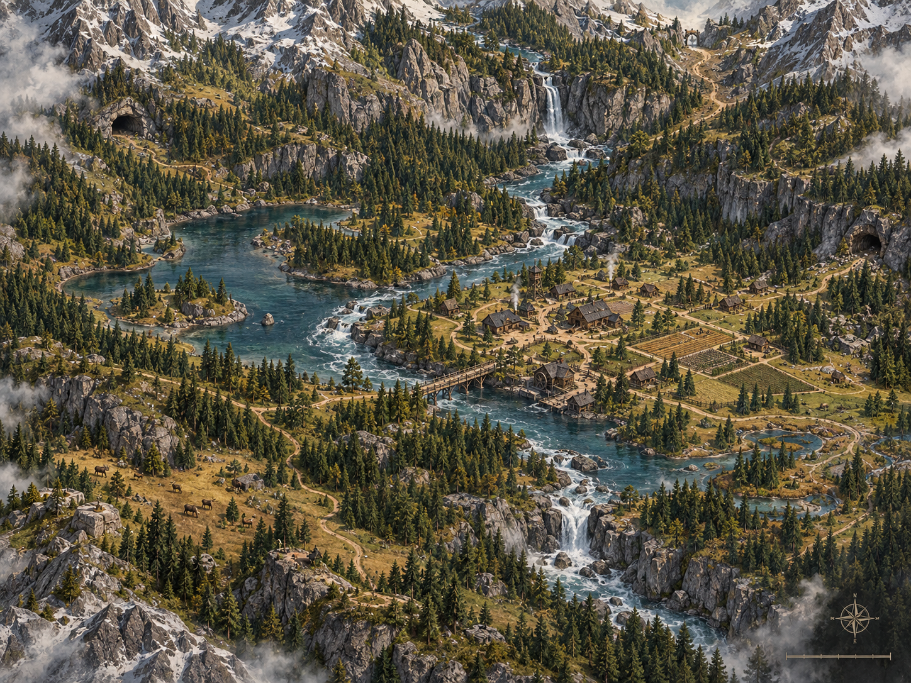
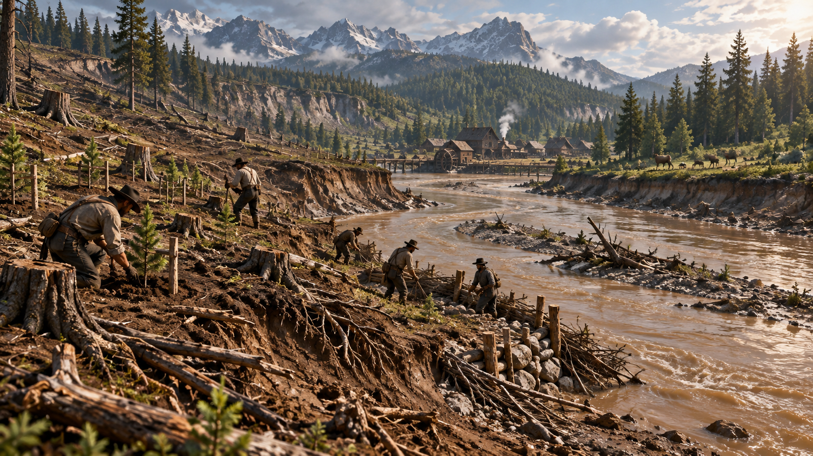

# The World

> **CONCEPT ART - AI ASSISTED. Not an in-game screenshot.**

The world is realistic.

No magic.

No supernatural powers are required to create danger or adventure.

Danger comes from:

- rivers
- mountains
- weather
- animals
- distance
- poor decisions
- resource scarcity
- human conflict

The world must be fully explorable.

Not every location should be easily accessible from the beginning.

Players should learn how to cross rivers, survive cold regions, explore mountains, hunt dangerous animals and travel long distances.

The environment reacts to player behavior.

Examples:

- excessive deforestation can damage soil and water
- excessive hunting can affect animal populations
- poor land use can reduce productivity
- careful management can allow damaged regions to recover

The world must allow mistakes.

Mistakes create consequences.

Consequences create stories.

Recovery should normally remain possible through knowledge, cooperation and time.

> **CONCEPT ART - AI ASSISTED. Not an in-game screenshot.**
